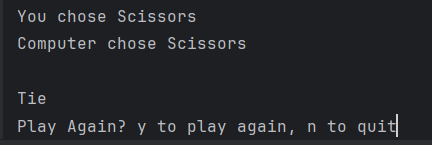

# 🪨 📄 ✂️ RPS Battle - A Python Rock-Paper-Scissors Game



A terminal-based Rock-Paper-Scissors game with ASCII art visuals, built with Python. Battle against the computer in this classic hand game!

## ✨ Features
- **ASCII Art Visuals**: See your choices come to life
- **Simple Controls**: Just type 1, 2, or 3 to play
- **Instant Feedback**: Clear win/lose/tie results
- **Play Again Option**: Quick rematches with one keypress
- **Error Handling**: Gracefully manages invalid inputs

## 🚀 How to Play
1. Clone the repository:
   ```bash
   git clone https://github.com/KumiAmponsah/rps-battle.git
